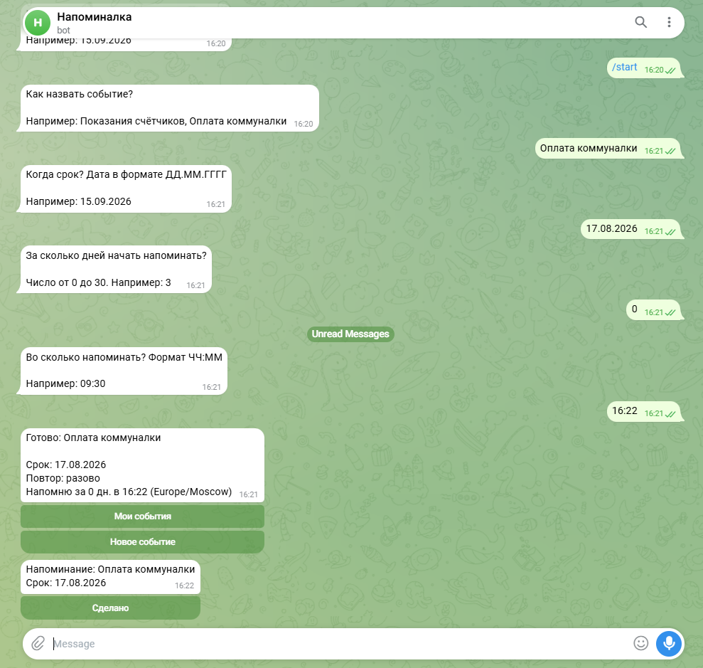
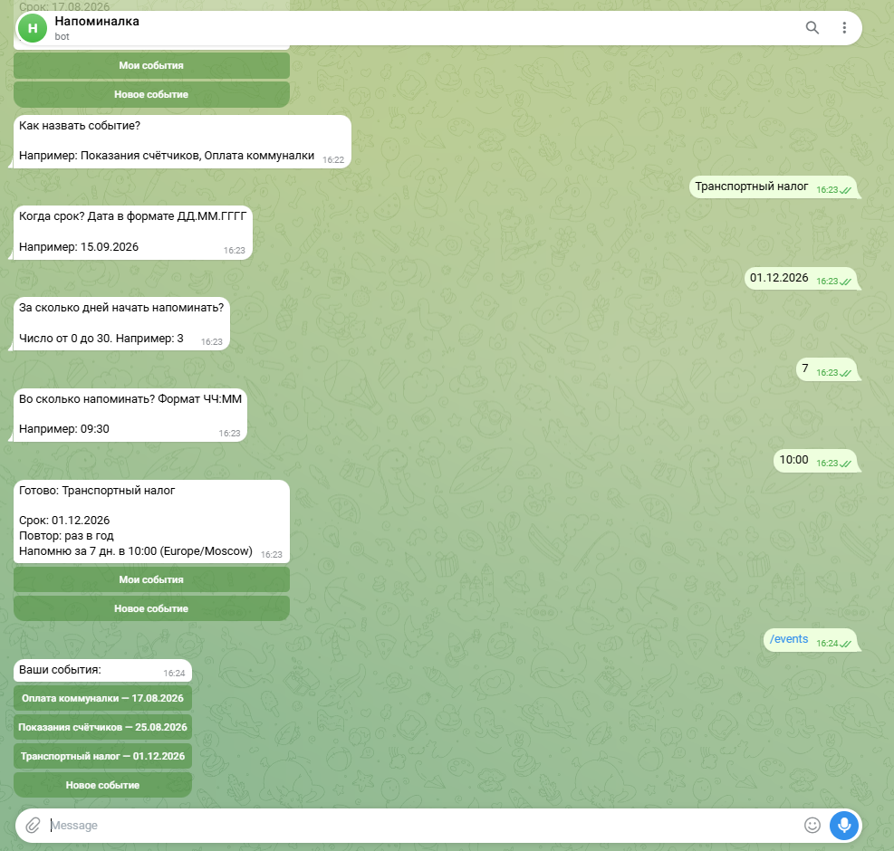
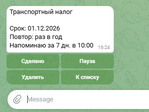

# Бот напоминаний о регулярных делах

Telegram-бот для дел, которые повторяются: подать показания счётчиков, заплатить коммуналку, сдать отчётность. Событие создаётся один раз, дальше бот напоминает сам.

Отличие от обычного будильника — цикл. Бот напоминает не один раз, а каждый день начиная за N дней до срока, пока вы не нажмёте «Сделано». После отметки напоминания текущего цикла прекращаются, а срок автоматически переносится на следующий период.

## Скриншоты

Создание события и полный цикл напоминания:



Список событий:



Карточка события:



## Что умеет

- Создание события пошаговым диалогом с проверкой ввода на каждом шаге
- Повторение: раз в месяц, раз в квартал, раз в год или разовое
- Окно напоминаний: за сколько дней начать и в какое время
- Кнопка «Сделано» — гасит напоминания цикла и планирует следующий срок
- Список событий, карточка с деталями, удаление
- Пауза: напоминания останавливаются, событие сохраняется
- Часовой пояс пользователя — время указывается по его местному
- Работа 24/7: задачи переживают перезапуск бота

## Технические решения

**Хранится срок, а не моменты напоминаний.** В базе лежит дата срока и настройки окна, а конкретные моменты вычисляются из них. Иначе при каждой отметке «Сделано» пришлось бы пересчитывать и перезаписывать множество записей.

**Календарная арифметика.** Наивное «прибавить месяц» ломается на конце месяца: 31 января + месяц даёт несуществующее 31 февраля. Функция `add_months` берёт минимум между исходным днём и последним днём целевого месяца. Для дел вида «оплатить до 31 числа» это критично — иначе бот молча не напомнит в феврале.

**Часовые пояса.** Моменты напоминаний создаются с явным указанием пояса пользователя через `zoneinfo`, планировщик работает в UTC. Без этого «напомнить в 9:30» означало бы 9:30 по времени сервера, а сервер обычно в UTC.

**Устойчивость к перезапуску.** APScheduler с хранилищем задач в SQLite: расписание не в памяти, а на диске. При старте бот дополнительно пересобирает расписание из базы событий. Прошедшие за время простоя напоминания не отправляются пачкой — `misfire_grace_time` ограничивает допустимое опоздание одним часом.

**Просроченные циклы.** Если событие было на паузе и все напоминания цикла прошли, при возобновлении срок автоматически переносится на следующий период. Иначе событие зависало бы в списке навсегда без единого напоминания.

**Диалог создания через FSM.** Состояния aiogram вместо ручного отслеживания, на каком шаге находится пользователь. Ввод проверяется на каждом шаге: дата в прошлом, дни вне диапазона 0–30, некорректное время — состояние не меняется, бот переспрашивает.

## Стек

- **Python 3.12**
- **aiogram 3** — Telegram Bot API, inline-клавиатуры, FSM
- **APScheduler** — планировщик с сохранением задач между запусками
- **SQLite** — события и настройки пользователей
- **zoneinfo** — часовые пояса (стандартная библиотека)

## Структура

```
bot.py                  — хендлеры, команды, диалог создания события
database.py             — работа с SQLite
scheduler_logic.py      — календарные расчёты, моменты напоминаний
reminder_scheduler.py   — планирование и отправка напоминаний
keyboards.py            — inline-клавиатуры
states.py               — состояния диалога
```

## Запуск

```bash
git clone https://github.com/agladcenko/reminder-bot.git
cd reminder-bot
python -m venv venv
venv\Scripts\activate        # Windows
source venv/bin/activate     # Linux/macOS
pip install -r requirements.txt
```

Создать файл `.env` рядом с `bot.py`:

```
BOT_TOKEN=токен_от_BotFather
```

Запустить:

```bash
python bot.py
```

Базы `reminders.db` и `jobs.db` создаются автоматически при первом запуске.

## Команды

| Команда | Что делает |
|---|---|
| `/start` | Начало работы, главное меню |
| `/help` | Справка |
| `/new` | Создать событие |
| `/events` | Список событий |
| `/timezone Europe/Moscow` | Сменить часовой пояс |

## Развёртывание на сервере

Для круглосуточной работы бот запускается как systemd-сервис с автозапуском и перезапуском при сбое:

```ini
[Unit]
Description=Reminder Bot
After=network.target

[Service]
Type=simple
User=botuser
WorkingDirectory=/home/botuser/reminder-bot
ExecStart=/home/botuser/reminder-bot/venv/bin/python bot.py
Restart=always
RestartSec=10

[Install]
WantedBy=multi-user.target
```

```bash
sudo systemctl daemon-reload
sudo systemctl enable --now reminder-bot
sudo journalctl -u reminder-bot -f
```

> Telegram недоступен с серверов в РФ — нужен зарубежный VPS.
